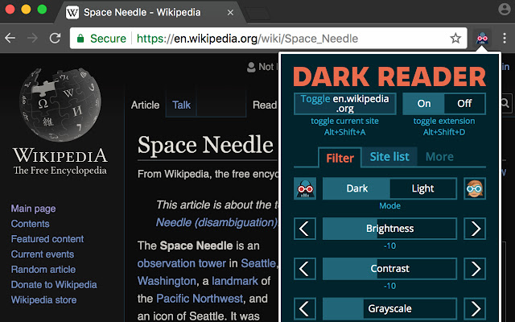
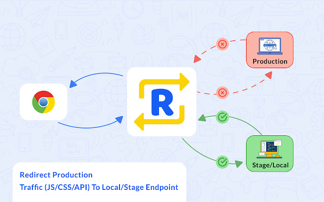

## 关于 <!-- omit in toc -->

这是一份个人认为很棒的 Chrome 插件列表。

前半部分是通用工具，适合所有人；后半部分是 web 开发工具，更适合 web 开发者。

## 安装 <!-- omit in toc -->

文中的链接地址是谷歌应用商店，如果你能够访问，可以直接一键安装、卸载。

如果无法访问，可以在国内网站 [扩展迷](https://www.extfans.com/) 下载离线包安装。

💡 太多的插件会导致 Chrome 变得臃肿，建议按需安装。

- 日常使用的保持开启；
- 偶尔使用的只在使用时开启；
- 几乎不用的则有需要时再装。

## 目录 <!-- omit in toc -->

- [功能增强](#功能增强)
- [网上冲浪](#网上冲浪)
- [Github 增强](#github-增强)
- [Web 开发](#web-开发)
- [极客工具](#极客工具)

## 功能增强

[**Infinity 新标签页 (Pro)** ](https://chrome.google.com/webstore/detail/infinity-new-tab-pro/nnnkddnnlpamobajfibfdgfnbcnkgngh)

[infinity 新标签页](https://www.infinitytab.com/) 几乎是国内最受欢迎的插件，有很多优点：

- 美观、高效、可定制。
- 多平台，支持移动端、PC 端和网页版。
- 支持账户登录和云端同步设置。
- 这些都是免费。

作为浏览器首页使用，体验拉满。好评如潮，24k+ 用户打分，依然保持满分 5 星。

---

[**Momentum**](https://chrome.google.com/webstore/detail/momentum/laookkfknpbbblfpciffpaejjkokdgca)

另一个流行的新建标签页插件，主打清爽，极简。如果你喜欢一个干净的首页，这是不错的选择。

---

[**OneTab**](https://chrome.google.com/webstore/detail/onetab/chphlpgkkbolifaimnlloiipkdnihall)

把众多标签页收束到一个标签页里，方便快速查看、恢复。

浏览器重度使用者的福音，有效避免这种标签页野蛮生长，难以查找的情况。

同时，能有效减轻浏览器的内存占用情况。

个人非常推荐的一个插件，我把它固定在工具栏，每当我觉得标签页太多了，我都会先收到一起，再把需要的恢复出来。

---

[**书签侧边栏**](https://chrome.google.com/webstore/detail/bookmark-sidebar/jdbnofccmhefkmjbkkdkfiicjkgofkdh)

更美观更便捷的侧边书签。

我难以接受 chrome 固定在顶部的书签栏，因为它占用了我的内容显示空间，所以我隐藏了它，但这样，我必须从右上角的【更多 - 书签 - 书签条目】中打开我的书签，这太不方便了。所以我转而寻找更高效的插件，书签侧边栏是我的最终的选择，它也是书签管理插件中最受欢迎的。我只需要把鼠标移到左侧，就可以快速打开书签。尽管新版 chrome 把书签入口置顶到工具栏，并且也采用了侧边呼出的形式，但我更喜欢这个插件。

---

[crxMouse Chrome 手势](https://chrome.google.com/webstore/detail/crxmouse-chrome-gestures/jlgkpaicikihijadgifklkbpdajbkhjo)

支持使用鼠标手势控制浏览器（可惜我是键盘党）。

---

[**Chrono 下载管理器**](https://chrome.google.com/webstore/detail/chrono-download-manager/mciiogijehkdemklbdcbfkefimifhecn)

这个插件的目标是“做 Chrome 浏览器中最好的下载管理器”。

如果你难以接受 chrome 的下载管理工具，这个插件是很好的替代方案。

除了下载管理，它还支持资源嗅探、批量下载图片等功能，适合经常下载资源的人。

---

[**扩展管理器**](https://chrome.google.com/webstore/detail/extension-manager/gjldcdngmdknpinoemndlidpcabkggco)

Chrome 拓展管理器，比自带的高效、美观。

## 网上冲浪

[**AdBlock**](https://chrome.google.com/webstore/detail/adblock-%E2%80%94-best-ad-blocker/gighmmpiobklfepjocnamgkkbiglidom)

广为人知的广告屏蔽插件，拒绝广告，还你更干净的的网页。

这类插件有很多，这个是使用最广的，现在已有上千万用户。

---

[**Google 翻译**](https://chrome.google.com/webstore/detail/google-translate/aapbdbdomjkkjkaonfhkkikfgjllcleb)

谷歌官方划词翻译插件，简单纯粹的翻译功能，可惜需要科学上网才能正常使用。

---

[**沙拉查词-聚合词典划词翻译**](https://chrome.google.com/webstore/detail/%E6%B2%99%E6%8B%89%E6%9F%A5%E8%AF%8D-%E8%81%9A%E5%90%88%E8%AF%8D%E5%85%B8%E5%88%92%E8%AF%8D%E7%BF%BB%E8%AF%91/cdonnmffkdaoajfknoeeecmchibpmkmg)

更多国内用户喜欢的划词翻译插件。功能更强大，支持多词典聚合查词和自定义设置。

还集成了强大的 [彩云网页翻译](https://fanyi.caiyunapp.com/#/web) 功能，翻译准确度很高，英语困难户救星。

---

[**简悦**](https://chrome.google.com/webstore/detail/simpread-reader-view/ijllcpnolfcooahcekpamkbidhejabll)

对于那些经常在网络上阅读，并且追求极致阅读体验的人，这绝对是一个不可错过的插件。

它适配了大部分的常用阅读网站，提取网页的内容，并呈现出更干净更适合阅读的界面。下图是在掘金文章上的使用对比。

---

[**Web Highlights**](https://chrome.google.com/webstore/detail/web-highlights-pdf-web-hi/hldjnlbobkdkghfidgoecgmklcemanhm)

网页阅读高亮工具，类似在电子书上的文字高亮。可以在阅读时标记，方便后续整理、回顾

---

[Dark Reader](https://chrome.google.com/webstore/detail/dark-reader/eimadpbcbfnmbkopoojfekhnkhdbieeh)

请务必爱惜你迷人的双眼。保护眼睛，从开启黑夜模式开始。

---

[**RSS Feed Reader**](https://chrome.google.com/webstore/detail/rss-feed-reader/pnjaodmkngahhkoihejjehlcdlnohgmp)

RSS 阅读器。关于 RSS，可以参考 [如何用 RSS 订阅？](https://juejin.cn/post/6844903760142024711)。

## 极客工具

[**Tampermonkey（油猴）**](https://chrome.google.com/webstore/detail/tampermonkey/dhdgffkkebhmkfjojejmpbldmpobfkfo)

用户脚本管理器。如果你需要使用用户脚本，必须安装脚本管理器。
用户脚本可以破解网站的限制、拓展功能，比如：破解复制禁用、资源下载等。可以前往 [Greasy Fork 用户脚本](https://greasyfork.org/zh-CN/scripts) 了解用户脚本的强大之处，我相信它会在某天派上用场。

---

[**Vimium**](https://chrome.google.com/webstore/detail/vimium/dbepggeogbaibhgnhhndojpepiihcmeb)

**像使用 Vim 一样使用 Chromium**。

如果你是 vim 用户，一定要装这个。即使你不是 vim 用户，只要你喜欢快捷键，你就应该尝试这个插件，相信我，你会爱上它的。

唯一的遗憾是在一些受浏览器保护的页面上无法使用，这是插件的局限。

## Web 开发

[**VisBug**](https://chrome.google.com/webstore/detail/visbug/cdockenadnadldjbbgcallicgledbeoc)

一个十分强大的网页 UI 走查工具，网页设计师和前端工程师的必备工具。可以在 [VisBug 网站](https://visbug.web.app/) 上体验它的功能。

---

[**CSS Peeper**](https://chrome.google.com/webstore/detail/css-peeper/mbnbehikldjhnfehhnaidhjhoofhpehk)

快速选定元素查看基本样式，不需要使用 devtool。比 visbug 更轻量。

不过，只能看到基本的字体、位置样式，也看不出样式的继承关系，所以更适合设计师，不太适合开发者。

---

[**Requestly: Modify Headers, Mock API, Redirect**](https://chrome.google.com/webstore/detail/requestly-modify-headers/mdnleldcmiljblolnjhpnblkcekpdkpa)

浏览器请求工具的集大成者。支持 HTTP Header 修改、API Mock、重定向、请求拦截器等，几乎能满足任何请求修改的需求。

---

[**ModHeader**](https://chrome.google.com/webstore/detail/modheader/idgpnmonknjnojddfkpgkljpfnnfcklj)

修改 HTTP 请求头和响应头，可以很方便地进行 HTTP Header 调试。比如，可以修改 `Access-Control-Allow-Origin: *` 来解决烦人的跨域问题。

---

[tweak](https://chrome.google.com/webstore/detail/tweak-mock-and-modify-htt/feahianecghpnipmhphmfgmpdodhcapi) -

在浏览器层面 Mock/修改 HTTP 请求。

---

[EditThisCookie](https://chrome.google.com/webstore/detail/editthiscookie/fngmhnnpilhplaeedifhccceomclgfbg)

更强大的 Cookie 管理工具。

---

[JSON Formatter](https://chrome.google.com/webstore/detail/json-formatter/bcjindcccaagfpapjjmafapmmgkkhgoa)

浏览器默认使用纯文本方式展示 JSON 数据，这个插件可以实现 JSON 的格式化。

---

[Live editor for CSS, Less & Sass - Magic CSS](https://chrome.google.com/webstore/detail/live-editor-for-css-less/ifhikkcafabcgolfjegfcgloomalapol)

直接编辑页面的样式，支持 CSS/Less/Sass。

这个插件有两种主要用途：

- 开发时，调试页面样式。
- 编写的样式可以保存永久生效，这样，可以自定义常用网站的样式。

---

[**Responsive Viewer**](https://chrome.google.com/webstore/detail/responsive-viewer/inmopeiepgfljkpkidclfgbgbmfcennb)

同时查看页面在不同尺寸下的渲染效果，响应式开发神器。

---

[Window Resizer](https://chrome.google.com/webstore/detail/window-resizer/kkelicaakdanhinjdeammmilcgefonfh)

快速切换窗口大小到指定尺寸，方便查看网页在不同窗口的呈现效果。

---

[**User-Agent Switcher for Chrome**](https://chrome.google.com/webstore/detail/user-agent-switcher-for-c/djflhoibgkdhkhhcedjiklpkjnoahfmg)

修改用户代理（user-agent） 字符串，兼容性开发时可能需要用到，谷歌官方提供。

---

[Web Maker](https://chrome.google.com/webstore/detail/web-maker/lkfkkhfhhdkiemehlpkgjeojomhpccnh)

本地离线版的 [CodePen](https://codepen.io/)，非常适合用于构建自己的简单 demo。

---

[**Wappalyzer - Technology profiler**](https://chrome.google.com/webstore/detail/wappalyzer-technology-pro/gppongmhjkpfnbhagpmjfkannfbllamg)

网站技术窥探，查看网站用了什么框架、工具库、分析工具等。

---

[Checkbot](https://chrome.google.com/webstore/detail/checkbot-seo-web-speed-se/dagohlmlhagincbfilmkadjgmdnkjinl)

网站测试工具，SEO、加载速度、安全性测试等。

这些是重要的网站指标，当你需要给网站优化时，不要忘了这类工具，使用它们来迅速获得一些普遍的有效建议。

---

[**React Develop Tools**](https://chrome.google.com/webstore/detail/react-developer-tools/fmkadmapgofadopljbjfkapdkoienihi)

react 官方调试工具，react 开发者必装。

---

[Vue.js devtools](https://chrome.google.com/webstore/detail/vuejs-devtools/nhdogjmejiglipccpnnnanhbledajbpd)

Vue 官方调试工具。

## Github 增强

[Octotree - GitHub code tree](https://chrome.google.com/webstore/detail/octotree-github-code-tree/bkhaagjahfmjljalopjnoealnfndnagc)

以树形文件目录的方式查看 github 项目文件，终于不用一层一层翻了，github 用户必备。

---

[**GitHub Hovercard**](https://chrome.google.com/webstore/detail/github-hovercard/mmoahbbnojgkclgceahhakhnccimnplk)

在 github 支持 hover 预览卡片。支持预览用户、仓库信息、issue。

---

[**GitHub Isometric Contributions**](https://chrome.google.com/webstore/detail/github-isometric-contribu/mjoedlfflcchnleknnceiplgaeoegien)

以 3D 形式展示贡献效果，有点盖楼的感觉。

---

[**Material Icons for GitHub**](https://chrome.google.com/webstore/detail/material-icons-for-github/bggfcpfjbdkhfhfmkjpbhnkhnpjjeomc)

在 github 应用 material 图标展示，方便文件辨识。

---

[**Tiga - Github 国内下载和克隆文件加速**](https://chrome.google.com/webstore/detail/tiga-github%E5%9B%BD%E5%86%85%E4%B8%8B%E8%BD%BD%E5%92%8C%E5%85%8B%E9%9A%86%E6%96%87%E4%BB%B6%E5%8A%A0%E9%80%9F/niemgccefhbiambnhhlpcpfcfbkmoobi)

Github 国内下载加速。
